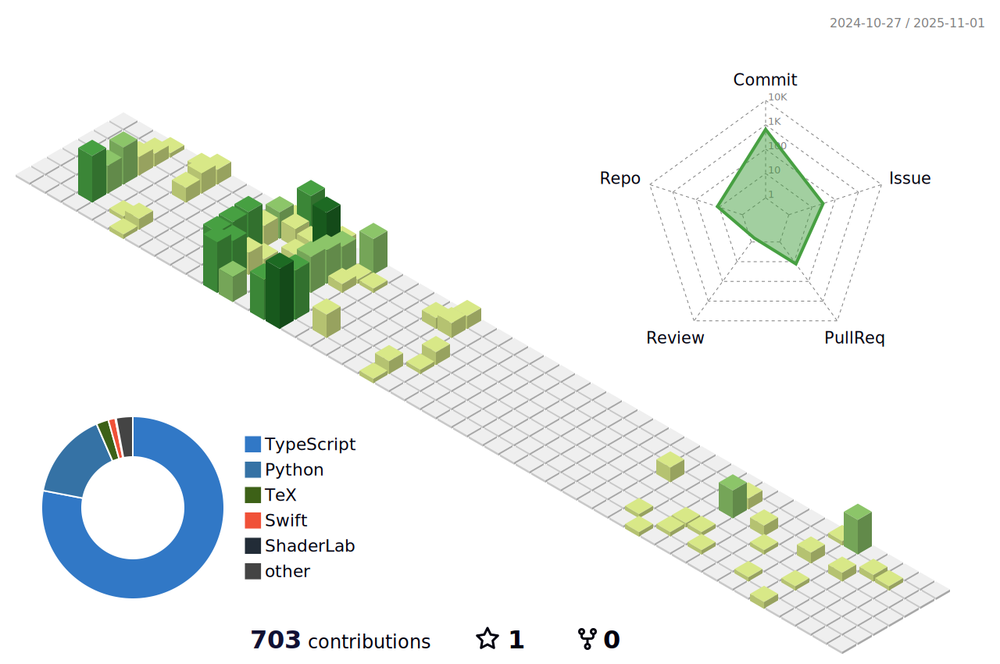

# Hi there 👋 I am David

I am studying for a B.S. in Computer Science in Vanderbilt University. You can see more about me on <a href="https://www.dahuang.dev/">my website</a>

<!--

    

  

    

-->
<!--
## Projects I am working on

### <a href="https://github.com/DavidHuang2002/ifam-attendance-portal">  I-FAM Events and Attendance Portal </a>

This is a web platform with both a public website that will allow the organization International Family to post their events and allow participants to RSVP, as well as an admin portal to allow event organizers to take attendance and see analytics about past attendance. Building using Next.js + Firebase.

## Projects I have built

### Device Management platform

A simple device management microservice platform that connects to IoT devices (such as Raspberry Pi and coffee machines), displays their current states and sends alert emails based on rules that users set. 

<a href="https://github.com/DavidHuang2002/ifam-attendance-portal"> Back-end </a>

The backend is a microservice built with .NET framework, containerized with Docker, and deployed onto Azure Web Service. The service leverages Azure Cloud’s IoT hub, Stream Analytics, and Service Bus for connecting to devices, processing their messages, and receiving them in the service.

<a href="https://github.com/DavidHuang2002/ifam-attendance-portal">  Front-end </a>

A simple Vue.js front-end for the platform.
-->

<!--
**DavidHuang2002/DavidHuang2002** is a ✨ _special_ ✨ repository because its `README.md` (this file) appears on your GitHub profile.

Here are some ideas to get you started:

- 🔭 I’m currently working on ...
- 🌱 I’m currently learning ...
- 👯 I’m looking to collaborate on ...
- 🤔 I’m looking for help with ...
- 💬 Ask me about ...
- 📫 How to reach me: ...
- 😄 Pronouns: ...
- ⚡ Fun fact: ...
-->
